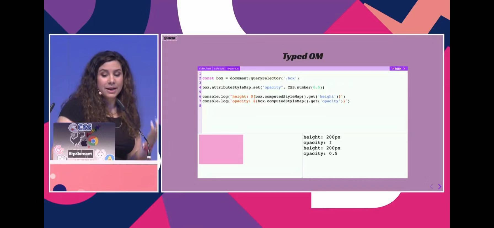
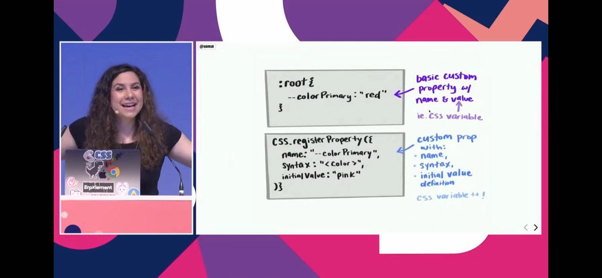
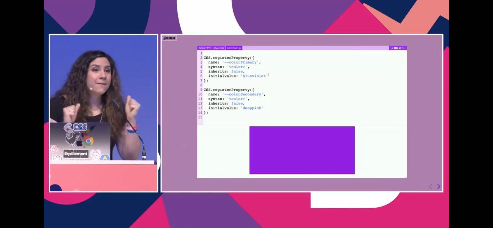
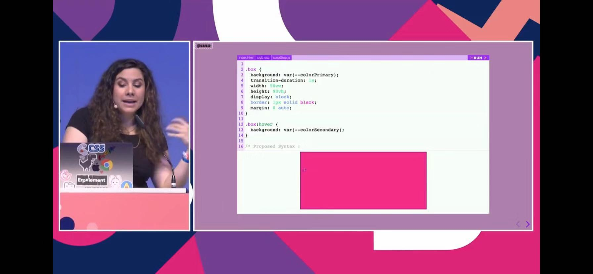
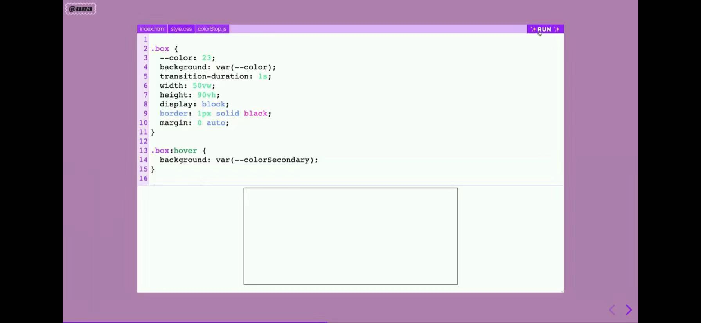

## CSS Houdini和样式的未来

翻译&校验：[freedom](https://github.com/yylifen)
> **PS：**PPT截图不全，建议大家直接观看视频。 
> **演讲者：**[Una Kravets](https://twitter.com/una)作为IBM Design和Bluemix（两个 IBM 产品）的前端开发，还主持@toolsday和STEMinist两个播客，从创造性和实用性的设计方法到促进社区开源状态，在社区有很多积极的影响。

<iframe width="620" height="349" src="https://www.youtube.com/embed/GhRE3rML9t4" frameborder="0" allow="accelerometer; autoplay; encrypted-media; gyroscope; picture-in-picture" allowfullscreen></iframe>

Houdini-CSS的未来马上就要到来！该规范允许开发人员使用JavaScript语法在工作中编写Web，并首次访问CSS对象模型。一切都会改变的！

在本演讲中，我们将介绍使用[Houdini](https://developers.google.com/web/updates/2016/05/houdini)及其各种即将推出的浏览器API可以创建的一些视觉魔术，并介绍如何开始实践。了解如何使用Houdini以及它对Web应用程序样式的未来意味着什么。

### 正稿

大家好。我很兴奋能来这里。和你谈论Houdini，有太多的我想给大家分享的东西，让我迫不及待地想立马就开始。我喜欢这个是有原因的。当我还是个小孩的时候，我有一个小狗，它生病了。

这就像15年前写的CSS，那时我们没有今天的技术，我们有定制的属性，有太多的东西在我们手中，它使网络的写作风格变得如此的快乐。CSS仍然有它的失败和面临的挑战，对吧？让我们谈谈表单样式。为什么？为什么我们不能在2019年设计表格呢？如果你熟悉[W3School](https://www.w3schools.com)，一个教育网站，它向你展示了代码编写网页的基本方法，所以我看到了这个定制的下拉列表，我想，“哦，酷。”我们的步骤是我们有HTML，我们添加CSS-很好-那里有一些工作室元素，然后我向下滚动，这有个[声音问题]。

直到今天，这依然令人沮丧，因为我喜欢把逻辑和样式分开。你不能直接在线上处理。虽然我们可以在线上做到动态渐变，它们很酷，你可以创建一个逗号分隔值的列表-在页面上-你可以调整这些东西。你可以把它们分层。

所以当你在图像上创建过滤效果时，它就变成了一个非常好的工具。我在网上用过这个。你可能还看不懂...

渐变。最重要的是，他们绕着中心转到那个点。如果我们想创造... 如果我们想要创建一个连续的渐变，我们会为第一个和最后一个值创建颜色，并在那里创建它。

如果我们看“我可以使用”，我们可以看到梯度没有很好的存储，所以我们不能在网络上使用这些。渐变是目前CSS中不存在的东西。在这里，我有一个例子，我有一个div，当我鼠标hover上去时，div从红色转换成蓝色。

这就是我在这个梯度里想要做的。我把它设置为右转，从红色到蓝色，然后转到深粉色。当我在这个梯度上悬停时，这个div不能转换这个值，我们稍后再讨论它。反正不能直接在线上实现。

自定义边框是你可以在网络上找到的东西。我们有一个边界数值资源，这很酷，但它是有限的。

如果你想做一些像角形状这样的东西，它会掩盖你的图像，并在这个元素上应用一个边框形状，这不是你能做的事情，这是200013规范谁试图推动这一点，但它从来没有真正进入浏览器-可悲。但不是还有Houdini吗？如果你没听说过Houdini，那真的有点糟糕。它基本上是一个专门为CSS提供个低级别API，更准确地说，它是一系列的API集合，允许开发人员访问css对象模型，它允许我们告诉浏览器我们希望它如何读取我们的css代码。所以，这就是现在想要发生的事情吗？如果你想在Web上将当前不存在的样式设置为可以用CSS编写的CSS属性和值，就只能先为其编写JavaScript填充。因此，你的浏览器遍历这个解析器集并读取DOM和CSS对象模型，然后你必须再次使用JavaScript填充来完成这一任务，因为在页面已经加载样式之后，你将对其重新应用样式。

但是使用Houdini，我们可以直接将样式应用于CSS，所以我们现在和其他开发人员一样拥有强大的力量，因为我们可以在CSS步骤中告诉浏览器它在读取代码时应该做什么。真是令人兴奋。虽然在浏览器中实现规范需要一段时间，但是这仍然是一件好事，我们不希望浏览器一直实现不了任何我们想实现的东西。

如果你想要一个目前不存在的特性，你可以像傀儡一样，通过创建你自己的技术，CSS填充，创建JavaScript来完成它，并且它存在于浏览器中。挺酷的。现在最好的资源是Houdini，它准备好了-我们所有的浏览器都同意实现规范，以及W3规范，你可以为了[Houdini](http://ishoudinireadyyet.com/)去阅读。“我可以用吗？”。

这在很大程度上是一项正在进行的工作。最受支持的API是PaintAPI和类型化对象模型，因此由于我们的时间有限，这就是我们今天要重点关注的问题。

让我们从类型化的对象模型开始。类型化对象模型允许我们进行更多的CSS语义解析。这是什么意思呢？现在，它必须完成整个基于字符串的正则解析，这很慢，它在字符串中寻找一个ID、属性、类或一个特定的关键字-就像这里的点，以及从这个点到打开的大括号的字符串，然后寻找一个属性值，一个冒号，一个值，一个单位，一个分号，确保这些值是准确的值，并且它们能正常工作。这会变得非常混乱，而且比有一些结构化的数据要慢得多，所以类型化的对象模型提供了结构化的模型。

我得到了一个类似于高度的值，我们返回一个CSS单位值，这个对象返回一个值和一个单位，所以这更具有语义，因此它使读取CSS的速度更快。所以我在这里做了这个，我有一个盒子，它有宽度和高度。我们可以从计算机样式中获得属性，你也可以设置属性，属性和属性，然后我可以指定css.number给它一个类型，然后它将更新，当我们再次这样做时，我们看到它正在进行解析。

如果你在DevTools中查看这一点，你将得到CSS单元值对象，其中将该单元与值分隔开来。这就引出了属性和值API。你们中有谁现在使用过自定义属性吗？大概有30%。自定义属性非常棒，因为它们是我们没有浏览器的实际动态CSS变量。与Sass不同的是，你使用的是一个静态变量，它将移植到某个值，在这里，你可以在JavaScript中更新这些变量。

你可以再次分离你的逻辑和样式，因为你可以将样式部分保存在CSS中，并执行逻辑在JavaScript中更改该值，然后传递它，并且具有超级动态和酷的特性，因此你可以使用基本的自定义属性获得一个名称和一个值，但是使用属性和值API，你可以得到更多的信息。你可以为它指定一个名称，为它指定一个语法，以及一个初始值定义，如果它不打算从它的父继承。让我们再看看梯度的例子。我们有盒子，有颜色，而且它是定制的，我正在从那个颜色过渡。我指定过渡时间是一秒长，在悬停时，它会变成蓝色。

所以，再说一遍，这里还是没有互动。应该花一秒的时间来注册那个颜色。我们想叫什么就叫什么。

我有颜色停止，语法是颜色，并指定那个语法.我不会继承初值，它将是透明的。当我把这个更新到颜色停止，在这里更新这个值，也更新到颜色停止，我更新到颜色停止，如果我创建悬停来匹配所有这些并运行这个，它会慢慢淡出蓝色。[掌声]。

我喜欢视觉演示！就像，哇。我输入了一个属性名，注册属性，现在有这么多的事情可以在后面的属性完成。

它不仅仅是一个字符串值。对于浏览器来说，理解这两个值之间的插值是有实际意义的。关于自定义属性的另一件事是，你可以设置初始值，回退值。我有注册了两个属性，颜色初级和二级。

如果你看CSS，我们正在从颜色主要过渡到二级悬停。我们得到了一秒的转换，如果你注意到的话，我实际上并没有指定这个自定义属性，这个变量在这里的CSS中。我不必这样做，因为我已经在CSS注册的属性中注册了它。

我可以更新颜色原色。我可以做颜色的初级红色，然后如果我运行这个，它将更新为红色。那里没问题。我们可以随时更新。

如果我不小心，输入了一个像23这样的假值，它将永远回到蓝色紫罗兰色。让我告诉你，如果我没有注册一个自定义属性，背景中有一个无效的颜色，我运行这个，它回到透明。

CSS最好的地方是，当有一条错误的行时，它不会破坏你的程序，它只是忽略了这一行，这样你就可以继续你的事情了。但这是我们现在可以期待与这种空气通道和类型检查的CSS。所以这有点像输入CSS变量，我认为这对CSS系统、设计系统来说都很好，确保所有的东西都是超级内聚的，当你用CSS和你的团队为Web项目构建时，所有的东西都是一致的。所以，现在我想谈谈Paint工作台。如果你听说过服务工作者和Web工作者的工作方式是一样的，因为这是一个介于你-它预先呈现的资源和推送通知之间的层，因为他们生活在你们中间。

当你打开网站时，你可以在你的网站上注册一个工作台，这样你就可以随时访问它，即使你的网络是脱机的。因此，如果我们要注册工作人员，使用Paint工作台，那么我们在JavaScript中所做的就是注册这个类型。我们给它起个名字。

我这里用的是一门课。你可以把它放进去。在HTML中我们需要... 需要将其添加到页面中，然后调用命名寄存器所绘制的内容，然后调用CSS，你将按名称指定工作剪辑，因此在本例中我将其称为“有趣”，我很享受在后台绘制乐趣。

这是JavaScript和CSS吗？是。让我们来看看我做的这个小例子。

这只是一些文字，我正在做的是，我写了这个小彩虹工作表，我从左上角到右下角，用这些像素值来调整大小。然后，在HTML中，我向CSS中添加Worklet，然后添加样式，使用它的方式是设置背景图像。你可以设置一个边框图像，用你想用的任何方式。这是在CSS中获得所有这些效果的一行代码。

把这些问题分解。这是我们的锥梯度。你也可以写Polly文件。

现在，有一个填充。在这个多边形中，写出这个允许渐变的工作单元，你可以在上下文中发送几何图形、属性和参数。因此，发送这些参数允许我们在这里的CSS类型中填充“红色”，然后我们可以运行这个，在浏览器中，我们得到了我们以前看到的梯度现在是一个完整的循环。这挺酷的。特性语法将允许我们这样做，在变量中使用这些，我们可以做背景梯度，现在我们有了语法。

再说一次，这是实验性的。这就像在扩展Web的边界。太酷了。我现在从事素材设计也是这样。

我们为开发人员提供了一个平台来创建他们自己的定制主题，其中包括颜色、主题和形状，这个例子就是一个叫做Shine的例子，在这里我们有这个角度的形状。这是我们所拥有的两种形状规范，所以圆角是一种，你绝对可以在线上做到这一点，但是在线上我们还不能这样做。正如我之前所展示的那样，这个角落形状规范从来没有真正地被落实到浏览器中。

但是，我们可以在这方面做一些工作。你可以创建一个CSS Houdini Paint工作板，这是一个我做的，只是指定不同的角半径，Paint风格被覆盖，或填充，你只要开始玩， 就会得到一个非常好的感觉。你可以使用它来装饰或者处理背景。记得我用的例子就是处理显示背景的。

当你使用WebKit遮罩图像时，你可以为任何元素指定在遮罩处所做的事情，然后我将这些技术结合起来重新创建这些素材按钮，但在这里使用凹槽。这是最初的版本，这里的一个巨大挑战是，当你犹豫时，就会产生涟漪效应，所以我在制作凹槽角工作板时，使用了背景和遮罩混合的方法，并将其应用于CSS中的这些勾画按钮和填充按钮。

因此，你可以使用现有的基础设施，并逐步增强它，因为你可以使用这种支持，如果你使用的是背景，它将回到CSS中的前一行。这就是我们现在可以把它集成到我们的UI中的方法。我们继续来点魔法吧。我要在这里做一个现场演示。

祝我好运。警告：这是实验性的，所以启用了Web平台功能。另外，你必须使用ACDV或本地主机，因为它位于页面之外，是为了安全性。

我希望这能行。那么，让我们从画布开始。我这里有一张画布，我已经准备好了，所以它只是给了它一个宽度和高度。我要放大这里，这样你就能看得更清楚一些。

在我的JavaScript中，我有一个随机函数，设置画布，给出闪烁、高度、重量宽度和位置的参数。它将随机化高度、宽度和重量，随机地把它的位置随机化。

我们会把颜色设定好，然后再把这个画出来。这就是为什么每次我刷新的时候，我都会得到一个随机的火花。我们不想要一个火花，我们可能需要多个火花。让我们设定30个火花。我们在这里创建一个循环来循环并应用火花。

一旦重新便已完成，我们就有了所有的30个火花，这是一个好的开始。我觉得这个颜色的黄色有点太相近，所以我们可以用HSL值来得到一个真正的饱和值，所以我做了一个随机的介于90到100之间。色调将是黄色/橙色的范围，光是变化最大的东西，所以我可以去掉颜色，我们有这个画布，但是我现在想把它变成一个Paint工作板，对吗？我们把这些都处理掉。

让我们用一些我们都熟悉的东西，这是... 这是展示X的Codepen吗？你知道你能改变它吗？这里的主要问题是空格保持它们的位置。我会让你看看这里是什么样子的。如果我一路放大，你可以看到这是X的布局，我们要试着在这个X上做一些Houdini的魔术。

所以，既然BBC去掉了HTML中的画布，我们现在需要做的就是摆脱JavaScript中的画布，因为我们不再需要使用过任何东西，我们只需要开始编写一个工作环境。我们就先这么做吧。

让我们做一个类型检查，以便我们可以看到类型的注册Paint是不等于已经准备好了，然后我们将创建一个类，创建一个类调用“火花”。然后在里面，我们要用Paint。我们将得到我们想要应用到的div的上下文和大小。从那里开始，我们想把这个放进这里。

所有这些我们都做了，我们创造了这些火花，并把它们放在这里。现在我已经开始了另一个工作，但我们必须先注册它。让我们在我们的语句之外进行检查，看看它是否被支持，我们需要注册一个Paint，我们将使用Splkles作为它的名称，我们必须将这个类称为Splkles。

所以我们现在要做的是确保我们得到的大小和高度，不是从画布，而是从元素，所以我们必须更新到大小。我们必须确保在这里调用这个JavaScript代码，在Codepen内部这样做的方法是使用你的PenID，这有点麻烦。我得注册这个脚本。我要获取css.ache t.worklet.Module。

理论上会开始监听这个文件。我要把它保存下来。在我们的空格里面，每一块空格，我都要做一个背景来绘制火花。如果这一切都解决了，我们会看到一些火花。有时候，我得刷新一下才能让它正常工作。

哦，不!发生了什么？好吧。我们来看看这个。

它有个名字。我们用这个脚本将它添加到HTML中。CSS画图工作区。我们把它应用到我们的空格上，用我们当时的名字。

嗯，这不管用，所以，我们就在另一个小的起动器里做这个。我给你看看这是什么样子。

我们有后援！[掌声]。那就太酷了！[掌声]。所以你可以玩这些幻灯片。

你可以和那个非常酷的Codepen一起玩。接下来，我得到了这些输入属性，所以我从我们的文档中提取输入属性，在这里我创建了一个名为“闪烁”的自定义属性，在动画中画了一个名为闪烁的关键帧，正在提取这些值并更新这些值，并使用它作为我的动画的素材。因为这不是一个注册的属性，它不会插入你想要的那些值-它不会每次都回到那个值上。

昨天我学到了一件事。这就是它的样子，但还记得我提到这是CSS中真正的JavaScript吗？所以，是谁创建了houdini.Rocks，他创建了这个只计算自定义属性的Worklet，所以基本上可以在CSS中放置所有这些代码，然后可以在CSS中应用背景绘图。它是超级元，但是你正在编写JavaScript，我想你可能想要应用它。我想你会喜欢的。

[掌声]。谢谢。

因此，这个方法有一些注意事项，那就是它是对分号敏感的。另外，你的变量必须在实例化中，它们不是动态的，所以你无法获得这些静态属性并在这里应用这些属性。你必须把它放在一个地方。如果这可能是它自己的自定义属性，你可以将它包含在元素中，但你现在不能这样做，我很乐意这样做。

如果你这样做，你必须确保它都在一个地方。现在我想谈谈其他的事情。[extra.css](https://extra-css.netlify.com/)是我一直在研究的一个小库，它允许你今天在自己的应用程序中使用Houdini。

这是一个CSS Houdini Paint API库，使你的网站更特别一些。我们可以在这里做的是玩所有这些不同的东西，比如火花演示，你可以改变火花的数量。你可以通过改变宽度变量、高度变量、使它们更厚的重量来使它们变大，你可以创建这个扇贝边框，给它任何你想要的颜色，你可以玩它的重量，所以你可以在这里调整它。为什么有一个下划线，当你可以有许多下划线？所以，我们有超级下划线。

你可以调整下划线的数量，那些下划线的传播，那些下划线的重量，只是玩它的一点乐趣。有一个交叉，所以你也可以调整这个颜色，你可以改变这个交叉的重量，然后纸屑，因为谁不喜欢纸屑？纸屑是一个有趣的小东西添加到任何网站。

在这里，你可以控制它的外观。使用它的方法是现在就可以使用它，方法是用一个CDN侦听来设置它，所以在HTML中，这个例子中，我将关闭这个结果。我正在做的是，我们只是把工作日志作为一个文件，对我昨天在这方面工作的第一个撰稿人大喊一声。耶。

所以在这里你可以包括你的脚本，然后在你的CSS中，你可以设置属性，如果你想要覆盖它们，或者你可以只使用背景画，它将采用默认值，就像我前面给你看的那样。有了一行代码，一个脚本，你就可以让Houdini现在Chrome稳定版上工作，在将来的Edge中，我也会在上面测试这些幻灯片，它们可以正常运行，所以非常酷。我希望将来能看到更多这样的事情。

这是一个伟大的方式，它给予开发者如此多的控制风格，我们的网站。所以，你可以把所有这些东西结合起来，做出这样的布局，就像Aga说的，我会为我的播客的每一个听众介绍一首歌并唱歌他听。我想我应该用一首小曲来结束这一切。能给我点音乐吗？[电子钢琴音乐]我这么做希望你们大家快乐。

> 歌词翻译

* 试试看。
* 与Stylus一起访问网站。
* 甚至几乎和当地人在一起。
* 首先，我非常感谢。
* 谢谢大家在网上早安。不过我不明白。
* 一个教会了我爱。
* 一个教我建立耐心。
* 现在我的画看起来棒极了。
* 我学会了，我也分享了。
* 但请不要看它。
* 改变技术是一种习惯。
* 对此，我说。谢谢下一个！

> 谢谢！[欢呼和掌声]。

* [Twitter @una](https://twitter.com/una)
* [Github @una](https://github.com/una)
* [Website una.im](http://una.im/)

[演讲稿原文地址 https://2019.jsconf.eu/una-kravets/css-houdini-and-the-future-of-styling.html](https://2019.jsconf.eu/una-kravets/css-houdini-and-the-future-of-styling.html)